# MANUAL TECNICO Y DE LOGICA DE NEGOCIO - SISTEMA DE ARRIENDOS

> **Version:** 2.1
> **Fecha:** 29 de Julio de 2026
> **Descripcion:** Documentacion completa del sistema de gestion de arriendos de ambientes para la Institution Policial.

---

## TABLA DE CONTENIDOS

1. Introduccion y Arquitectura General
2. RBAC - Control de Acceso Basado en Roles
3. Modelo de Datos Completo
4. Maquina de Estados del Arriendo
5. Logica de Negocio por Modulo
6. API Endpoints Documentados
7. Frontend - Estructura y Flujo
8. Formularios PDF y Reportes
9. Guia de Modificaciones

---

## 1. INTRODUCCION Y ARQUITECTURA GENERAL

### 1.1 Que es este sistema?

El **Sistema de Arriendos** es una aplicacion web para gestionar el alquiler de ambientes (salones, salas, espacios) de una institucion policial. Permite:

- Registrar inmuebles y sus ambientes (salones)
- Crear y gestionar arriendos de estos ambientes
- Controlar el ciclo de vida de un arriendo (desde la pre-reserva hasta la conclusion)
- Registrar pagos y garantias
- Generar formularios PDF (contratos, formularios de entrega, etc.)
- Generar reportes en Excel

### 1.2 Arquitectura Tecnica

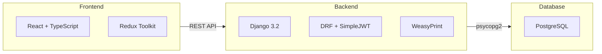

### 1.3 Estructura de Directorios

```
Arriendos-Backend/
├── Arriendos_Backend/    # Configuracion Django
│   ├── settings.py       # Configuracion principal
│   └── urls.py           # URLs raiz
├── login/                # Autenticacion
├── rooms/                # Inmuebles y ambientes
├── customers/            # Clientes
├── products/             # Productos (tarifas, precios)
├── plans/                # Planes de descuento
├── requirements/         # Requisitos
├── leases/               # Arriendos (NUCLEO)
├── financials/           # Pagos y garantias
├── users/                # Usuarios y auditoria
├── roles/                # RBAC
├── records/              # Auditoria
├── templates/            # Templates HTML para PDFs
├── initial_data/         # Datos iniciales
└── manage.py
```

```
arriendos-frontend/
├── src/
│   ├── main.tsx
│   ├── App.tsx
│   ├── router/           # AppRouter.tsx
│   ├── store/            # Redux slices
│   ├── hooks/            # Custom hooks
│   ├── services/         # Axios config
│   ├── views/
│   │   ├── auth/         # Login
│   │   ├── layout/       # Layout principal
│   │   └── pages/        # Todas las vistas
│   └── components/       # Componentes reutilizables
└── package.json
```

### 1.4 Dependencias Principales

**Backend:**

| Paquete | Proposito |
|---------|-----------|
| Django 3.2 | Framework web |
| djangorestframework | API REST |
| simplejwt | Autenticacion JWT |
| psycopg2-binary | Conexion PostgreSQL |
| weasyprint | Generacion PDF |
| openpyxl | Generacion Excel |
| ldap3 | Autenticacion LDAP |
| threadlocals | Tracking usuario |

**Frontend:**

| Paquete | Proposito |
|---------|-----------|
| @mui/material | Componentes UI |
| @reduxjs/toolkit | Estado global |
| react-router-dom | Navegacion |
| axios | Peticiones HTTP |
| jwt-decode | Decodificacion JWT |
| react-big-calendar | Calendario |
| react-toastify | Notificaciones |
| sweetalert2 | Dialogos modales |

---

## 2. RBAC - CONTROL DE ACCESO BASADO EN ROLES

### 2.1 Arquitectura RBAC

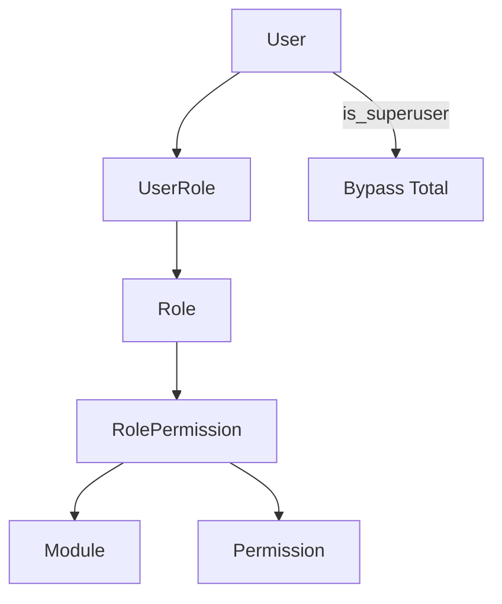

**Archivos clave:**
- `roles/models.py` - Module, Permission, Role, RolePermission, UserRole
- `roles/permissions.py` - HasModulePermission
- `roles/views.py` - CRUD de roles
- `roles/serializers.py` - Validaciones RBAC
- `users/audit.py` - Auditoria RBAC

### 2.2 Las 25 Reglas RBAC

#### Autenticacion vs Autorizacion

| # | Regla | Descripcion |
|---|-------|-------------|
| R1 | Auth != Authz | Login (JWT) != Control de permisos. Se validan por separado. |
| R2 | Auth via LDAP o DB | Si LDAP_STATUS=True autentica contra LDAP. Si False usa DB local. |
| R3 | LDAP-only | Si LDAP=ON y el usuario NO esta en LDAP, NO puede ingresar. Sin fallback a DB. |
| R4 | Carga post-auth | Despues del login, el backend retorna role + permissions[] en la respuesta JWT. |

#### Roles y Permisos

| # | Regla | Descripcion |
|---|-------|-------------|
| R5 | Un solo rol por usuario | UserRole es OneToOneField. Un usuario solo puede tener un rol. |
| R6 | Puede existir sin rol | No hay FK constraint. Si no tiene rol, permissions=[]. |
| R7 | Sin rol = sin permisos | Frontend muestra "No tiene permisos. Contacte al administrador." |
| R8 | Permisos nunca directos | Solo se asignan via RolePermission -> Role -> UserRole. |
| R9 | Backend es autoridad | El backend valida permisos en CADA endpoint. Frontend solo oculta/muestra UI. |
| R10 | Todos los endpoints validan | Todas las views tienen HasModulePermission. |
| R11 | Permisos = acciones | Formato: modulo.accion (ej: products.view, leases.add). |

#### Reglas de Administracion

| # | Regla | Descripcion |
|---|-------|-------------|
| R12 | Al menos un Admin | Siempre debe existir al menos 1 usuario con rol Administrador. |
| R13 | No cambiar propio rol | Un usuario no puede asignarse un rol a si mismo. |
| R14 | No desactivarse a si mismo | Un usuario no puede desactivar su propia cuenta. |
| R15 | Admin cambiado por Admin o superuser | Un Administrador puede ser modificado (editar, desactivar) por otro Administrador o is_superuser. |
| R16 | Operador no cambia Admin | Un Operador no puede editar, desactivar o cambiar rol de un Administrador. |
| R17 | Operador asigna roles no-admin | Un Operador solo puede asignar roles que NO sean Administrador. |
| R18 | Solo Admin crea roles | Solo Administrador o is_superuser puede crear/editar/eliminar roles. |

#### is_superuser (Respaldo)

| # | Regla | Descripcion |
|---|-------|-------------|
| R19 | Bypass total | Si is_superuser=True, tiene acceso a TODO sin importar su rol. |
| R20 | Para respaldo | Disenado para recuperar el sistema si nadie tiene rol Administrador. |
| R21 | Puede asignar cualquier rol | Un is_superuser puede asignar rol Administrador a cualquier usuario. |
| R22 | No reemplaza roles | is_superuser es un mecanismo adicional, no reemplaza el sistema de roles. |

#### Seguridad

| # | Regla | Descripcion |
|---|-------|-------------|
| R23 | is_active controla cuenta | User.is_active=False desactiva la cuenta. Role.is_active=False desactiva el rol. |
| R24 | Auditoria RBAC | Todas las acciones se registran en Record con usuario, accion, detalle, timestamp. |
| R25 | Proteccion ultimo Admin | Backend y frontend bloquean la desactivacion del ultimo Administrador. |

### 2.3 Clase HasModulePermission

```python
class HasModulePermission(BasePermission):
    def has_permission(self, request, view):
        user = request.user
        # R19: is_superuser bypass total
        if user.is_superuser:
            return True
        # Obtener modulo de la vista
        rbac_module = getattr(view, 'rbac_module', None)
        if not rbac_module:
            return True
        # R6/R7: Verificar rol
        try:
            user_role = UserRole.objects.get(user=user)
            role = user_role.role
            if not role.is_active:
                return False
        except UserRole.DoesNotExist:
            return False
        # Verificar permiso especifico
        method = request.method
        action = self._get_action(method)
        # ... validacion en RolePermission
```

**Uso en vistas:**
```python
class Product_Api(generics.GenericAPIView):
    permission_classes = [IsAuthenticated, HasModulePermission]
    rbac_module = 'products'
```

### 2.4 Roles del Sistema

| Rol | Permisos |
|-----|----------|
| Administrador | Todos los modulos (view, add, change, delete) |
| Operador | products, rooms, customers, leases, financials, requirements (sin delete en users) |
| Cajero | financials (view, add, change), leases (view) |
| Juridica | leases (view), financials (view), requirements (view, add, change) |
| Consulta | Solo permisos view en todos los modulos |
| Visualizacion | Solo permisos view en todos los modulos |

### 2.5 Matriz de Permisos

| Modulo | view | add | change | delete |
|--------|------|-----|--------|--------|
| products | Ver | Crear | Editar | Eliminar |
| rooms | Ver | Crear | Editar | Eliminar |
| customers | Ver | Crear | Editar | Eliminar |
| leases | Ver | Crear | Editar | Eliminar |
| financials | Ver | Crear | Editar | Eliminar |
| requirements | Ver | Crear | Editar | Eliminar |
| users | Ver | Crear | Editar | Eliminar |
| records | Ver | - | - | - |
| documents | Ver | - | - | - |

### 2.6 Flujo de Autenticacion

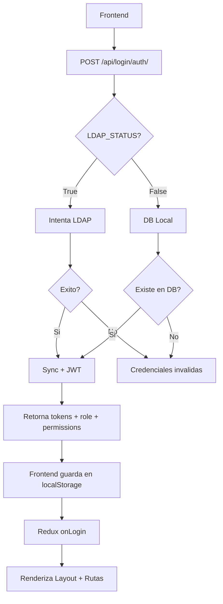

### 2.7 Frontend - Control de Permisos

```typescript
// useAuthStore.ts
const hasPermission = (permission: string): boolean => {
    return permissions.includes(permission);
};

// AppRouter.tsx - ProtectedRoute
const ProtectedRoute = ({ permission, children }) => {
    const { hasPermission } = useAuthStore();
    if (!hasPermission(permission)) {
        return <Navigate to="/dashboardView" />;
    }
    return <>{children}</>;
};

// menu.tsx - Filtrado por permisos
const filteredMenu = menuItems.filter(item => hasPermission(item.permission));
```

### 2.8 Auditoria RBAC

```python
# users/audit.py
def create_rbac_audit(user, action, detail, instance_id=None):
    Record.objects.create(
        user=user,
        action=action,   # ROLE_CREATE, ROLE_ASSIGN, USER_DEACTIVATE, etc.
        model="RBAC",
        detail=detail,
        instance_id=instance_id,
    )
```

| Accion | Descripcion |
|--------| creacion de rol |
| ROLE_UPDATE | Modificacion de rol |
| ROLE_DELETE | Eliminacion de rol |
| ROLE_ASSIGN | Asignacion de rol a usuario |
| ROLE_REMOVE | Remocion de rol de usuario |
| USER_ACTIVATE | Activacion de usuario |
| USER_DEACTIVATE | Desactivacion de usuario |

### 2.9 LDAP vs DB

| LDAP_STATUS | En LDAP | En DB | Resultado |
|-------------|---------|-------|-----------|
| True | Si | Si | Login exitoso, sincroniza password |
| True | Si | No | Login exitoso, crea usuario en DB |
| True | No | Si | Credenciales invalidas (sin fallback) |
| True | No | No | Credenciales invalidas |
| False | - | Si | Login exitoso (DB local) |
| False | - | No | Credenciales invalidas |

---

## 3. MODELO DE DATOS COMPLETO

### 3.1 Diagrama de Entidades - Inmuebles y Clientes

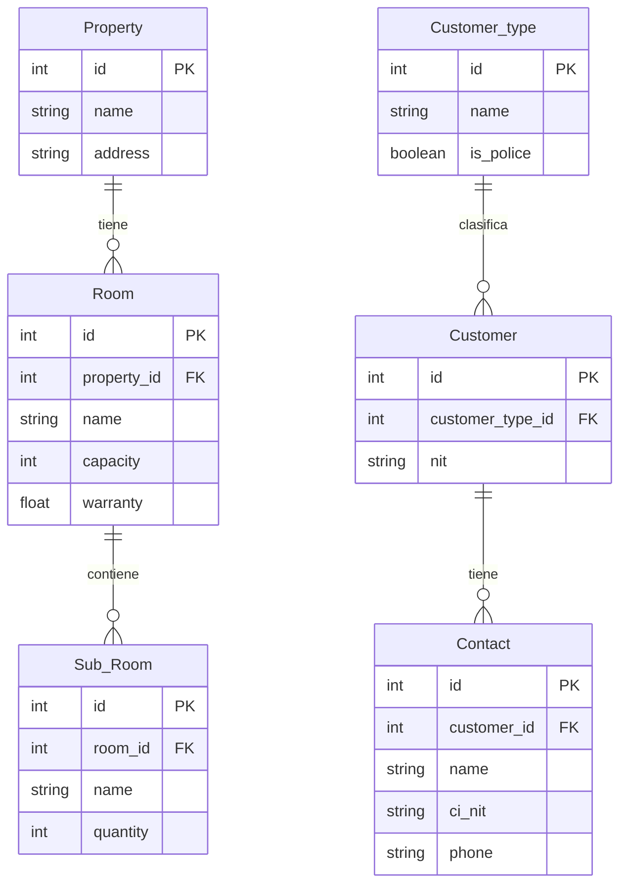

### 3.2 Diagrama de Entidades - Productos

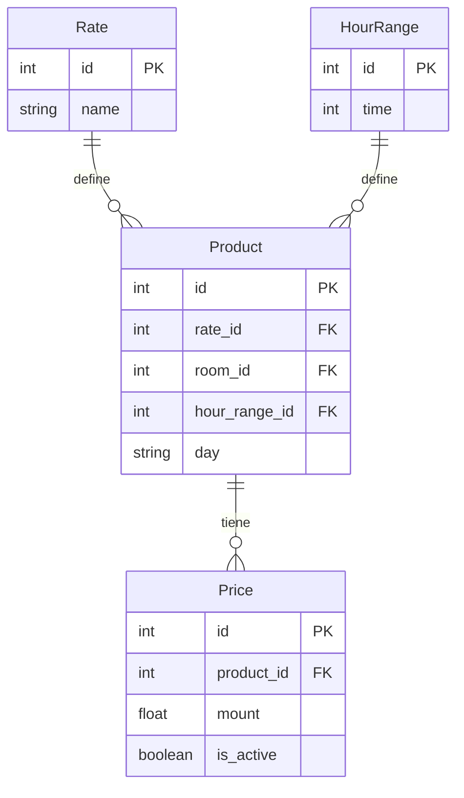

### 3.3 Diagrama de Entidades - Arriendos

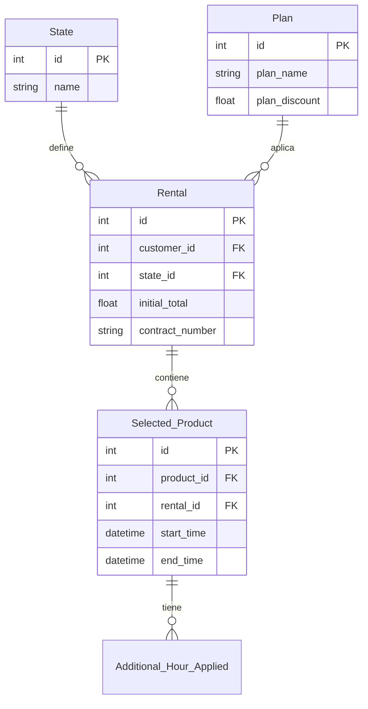

### 3.4 Diagrama de Entidades - Pagos y Garantias

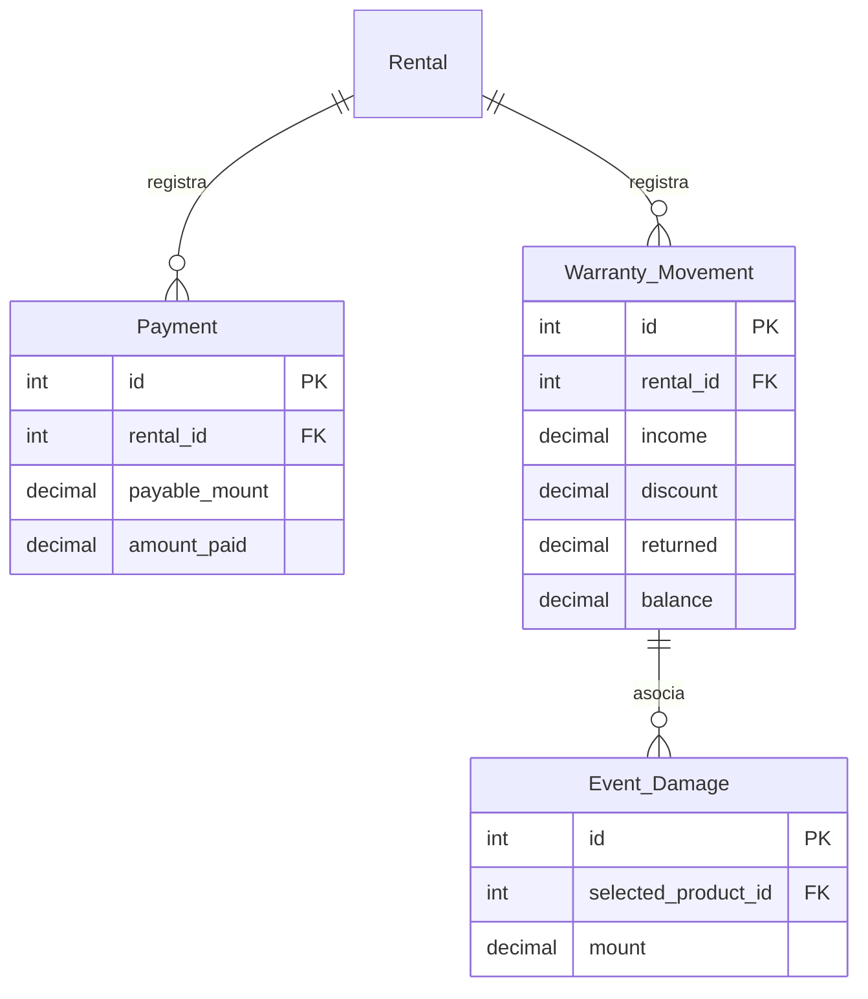

### 3.5 Diagrama de Entidades - Requisitos y Asignaciones

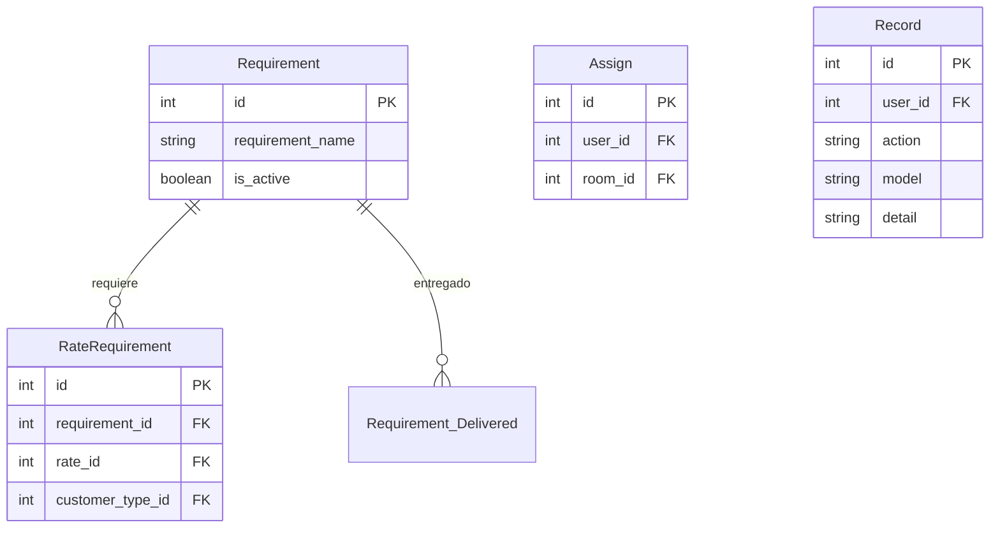

### 3.6 Descripcion de Modelos Principales

#### Property (Inmueble)

| Campo | Tipo | Descripcion |
|-------|------|-------------|
| id | Integer | Identificador unico |
| name | String(250) | Nombre del inmueble |
| address | String(250) | Direccion |
| department | String(100) | Departamento |
| photo | ImageField | Foto del inmueble |

#### Room (Salon)

| Campo | Tipo | Descripcion |
|-------|------|-------------|
| id | Integer | Identificador unico |
| property_id | FK -> Property | Inmueble al que pertenece |
| name | String(250) | Nombre del salon |
| capacity | Integer | Capacidad (personas) |
| warranty | Float | Monto de garantia base |
| is_active | Boolean | Si esta activo para arrendar |
| group | String(100) | Grupo/categoria |

#### Product (Producto)

Entidad central. Combina tarifa, salon, rango de horas y dias para definir un producto arrendable.

| Campo | Tipo | Descripcion |
|-------|------|-------------|
| id | Integer | Identificador unico |
| rate_id | FK -> Rate | Tarifa aplicable |
| room_id | FK -> Room | Salon arrendable |
| hour_range_id | FK -> HourRange | Duracion en horas |
| day | Array[String] | Dias de la semana |

**Ejemplo:** "Tarifa Normal" + "Salon Principal" + "4 horas" + ["Lunes", "Martes"]

#### Price (Precio)

Solo un precio puede estar activo por producto.

| Campo | Tipo | Descripcion |
|-------|------|-------------|
| id | Integer | Identificador unico |
| product_id | FK -> Product | Producto |
| mount | Float | Monto del precio |
| is_active | Boolean | Si es el precio vigente |

#### Rental (Alquiler)

| Campo | Tipo | Descripcion |
|-------|------|-------------|
| id | Integer | Identificador unico |
| customer_id | FK -> Customer | Cliente |
| state_id | FK -> State | Estado actual |
| plan_id | FK -> Plan | Plan aplicado (nullable) |
| initial_total | Float | Monto total inicial |
| contract_number | String(10) | Numero de contrato |
| cancel_reason | String(255) | Motivo de cancelacion |

#### Selected_Product (Producto Seleccionado)

| Campo | Tipo | Descripcion |
|-------|------|-------------|
| id | Integer | Identificador unico |
| product_id | FK -> Product | Producto seleccionado |
| rental_id | FK -> Rental | Arriendo |
| event_type_id | FK -> Event_Type | Tipo de evento |
| start_time | DateTime | Fecha/hora inicio |
| end_time | DateTime | Fecha/hora fin |
| product_price | Float | Precio al momento de seleccionar |

#### Payment (Pago)

Los pagos son acumulativos reduciendo el saldo pendiente.

| Campo | Tipo | Descripcion |
|-------|------|-------------|
| id | Integer | Identificador unico |
| rental_id | FK -> Rental | Arriendo |
| payable_mount | Decimal | Saldo pendiente DESPUES de este pago |
| amount_paid | Decimal | Monto pagado |

**Logica:** payable_mount = pago_anterior.payable_mount - amount_paid. Cuando payable_mount = 0, esta pagado completo.

#### Warranty_Movement (Garantia)

| Campo | Tipo | Descripcion |
|-------|------|-------------|
| id | Integer | Identificador unico |
| rental_id | FK -> Rental | Arriendo |
| income | Decimal | Monto ingresado (deposito) |
| discount | Decimal | Monto descontado (danos) |
| returned | Decimal | Monto retornado |
| balance | Decimal | Saldo de garantia |

#### Requirement (Requisito)

| Campo | Tipo | Descripcion |
|-------|------|-------------|
| id | Integer | Identificador unico |
| requirement_name | String(150) | Nombre del requisito |
| is_active | Boolean | Si esta activo |

#### RateRequirement (Requisito por Tarifa)

Define que requisitos son obligatorios segun Tarifa + Tipo de Cliente.

| Campo | Tipo | Descripcion |
|-------|------|-------------|
| id | Integer | Identificador unico |
| requirement_id | FK -> Requirement | Requisito |
| rate_id | FK -> Rate | Tarifa |
| customer_type_id | FK -> Customer_type | Tipo de cliente |

#### State (Estado)

| ID | Nombre | Siguientes estados |
|----|--------|-------------------|
| 1 | Pre-reserva | 2 (Reserva), 5 (Anulado) |
| 2 | Reserva | 3 (Alquilado), 5 (Anulado) |
| 3 | Alquilado | 4 (Concluido), 5 (Anulado) |
| 4 | Concluido | 5 (Anulado) |
| 5 | Anulado | Ninguno (final) |

---

## 4. MAQUINA DE ESTADOS DEL ARRIENDO

### 4.1 Diagrama de Estados

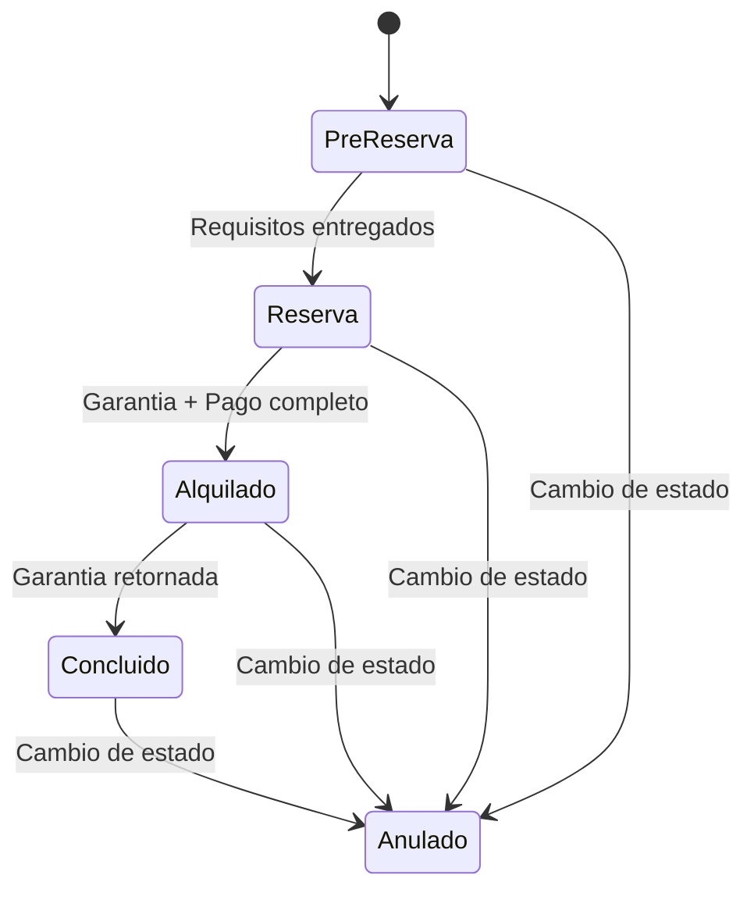

### 4.2 Reglas de Transicion

#### Pre-reserva -> Reserva (1 -> 2)

**Condicion:** Al menos un requisito entregado.

**Validaciones:**
1. Estado actual debe ser 1
2. Debe existir al menos un Requirement_Delivered
3. Si no hay requisitos: Error "No existen requisitos entregados"

**Efecto:** Se cambia state_id a 2, se genera contract_number formato {numero}-{anio}, se genera PDF contrato.

#### Reserva -> Alquilado (2 -> 3)

**Condicion:** Garantia registrada Y pago completo.

**Validaciones:**
1. Estado actual debe ser 2
2. Debe existir al menos un Warranty_Movement
3. Debe existir al menos un Payment
4. Ultimo pago debe tener payable_mount = 0

**Efecto:** Se cambia state_id a 3.

#### Alquilado -> Concluido (3 -> 4)

**Condicion:** Garantia retornada al cliente.

**Validaciones:**
1. Estado actual debe ser 3
2. Ultimo Warranty_Movement debe tener returned > 0

**Efecto:** Se cambia state_id a 4.

#### Cualquier Estado Activo -> Anulado (-> 5)

**Condicion:** El arriendo puede ser anulado desde cualquier estado activo.

**Validaciones:**
1. Estado actual debe estar en la lista de next_state del estado actual

**Efecto:** Se cambia state_id a 5, se guarda cancel_reason.

### 4.3 Flujo Ejemplo

```
1. Cliente arrenda Salon A y Salon B para capacitacion
   -> Se crea Pre-reserva con 2 Selected_Products
   -> initial_total = precio_A + precio_B - descuento_plan

2. Se registran requisitos entregados
   -> contract_number: "1-2026", se genera PDF contrato
   -> Estado: RESERVA

3. Cliente paga garantia 500 Bs + 1000 Bs del arriendo
   -> Warranty_Movement: income=500, balance=500
   -> Payment: amount_paid=1000, payable_mount=total-1000
   -> Cliente paga resto -> payable_mount=0
   -> Estado: ALQUILADO

4. Se registran 2 horas extra
   -> Additional_Hour_Applied por cada hora

5. Se detecta dano de 100 Bs
   -> Event_Damage: mount=100
   -> Warranty_Movement: discount=100, balance=400

6. Se retorna garantia (400 Bs)
   -> Warranty_Movement: returned=400, balance=0
   -> Estado: CONCLUIDO
```

---

## 5. LOGICA DE NEGOCIO POR MODULO

### 5.1 Modulo de Autenticacion (login)

**Ubicacion:** `Arriendos-Backend/login/`

**Flujo:**
```
Frontend -> POST /api/login/auth/ {username, password}
Backend -> Verifica credenciales (LDAP o DB)
Backend -> Genera JWT tokens (access + refresh)
Frontend <- {access, refresh, user_id, username, role, permissions}
Frontend -> Guarda en localStorage
```

**Token JWT:**
- Access token: 12 horas
- Refresh token: 1 dia
- Frontend verifica cada 30 segundos

### 5.2 Modulo de Inmuebles (rooms)

**CRUD Inmuebles (Property):**
- POST /api/rooms/properties/ - Crear
- GET /api/rooms/properties/ - Listar
- PATCH /api/rooms/properties/{id}/ - Actualizar
- DELETE /api/rooms/properties/{id}/ - Eliminar

**CRUD Salones (Room):**
- POST /api/rooms/ - Crear
- GET /api/rooms/ - Listar
- PATCH /api/rooms/{id}/ - Actualizar
- DELETE /api/rooms/{id}/ - Eliminar

**Inmuebles con Salones:**
- GET /api/rooms/properties/roomslist/ - Retorna inmuebles con salones anidados

### 5.3 Modulo de Clientes (customers)

**Logica de creacion:**

Si es Institucion (is_institution=True):
1. Se crea Customer con institution_name y nit
2. Se crean uno o mas Contact asociados

Si es Persona (is_institution=False):
1. Se crea Customer (sin institution_name ni nit)
2. Se crea un solo Contact (is_customer=True)

**Buscar Afiliado Policial:**
- GET /api/customers/identify_police/{ci}/ - Consulta microservicio externo

**Eliminar Cliente:** Solo si NO tiene arriendos activos.

### 5.4 Modulo de Productos (products)

**Concepto clave:** Un Producto = Tarifa + Salon + Rango de Horas + Dias

**Crear Producto:**
```json
POST /api/product/
{
    "rate": 1,
    "room": 1,
    "hour_range": 1,
    "day": ["Lunes", "Martes"],
    "mount": 500
}
```

**Gestion de Precios:** Solo un precio activo por producto. Al actualizar, se desactiva el anterior y se crea uno nuevo.

**Productos Posibles:**
- POST /api/product/posible_product/ - Envia tipo de cliente y salon, retorna productos que aplican

### 5.5 Modulo de Planes (plans)

Un Plan aplica descuento cuando se arrendan multiples salones.

**Ejemplo:** Plan "Multiple": 10% descuento, min 2 salones, max 5.

### 5.6 Modulo de Requisitos (requirements)

**Requisitos por Tarifa y Tipo de Cliente:**
- Tarifa "Normal" + Tipo "Policia Activo" -> CI, Carta de Solicitud
- Tarifa "Normal" + Tipo "Persona Civil" -> CI, Deposito de Garantia

**Registrar Requisitos Entregados:**
- POST /api/requirements/register_delivered_requirements
- **Efecto secundario:** Se genera contract_number y PDF contrato.

### 5.7 Modulo de Arriendos (leases) - NUCLEO

**Crear Pre-Reserva:**
```json
POST /api/leases/
{
    "customer": 1,
    "plan": 1,
    "selected_products": [
        {
            "product": 1,
            "event_type": "Capacitacion",
            "start_time": "2026-07-15T09:00:00.000Z",
            "end_time": "2026-07-15T13:00:00.000Z",
            "detail": "Capacitacion en seguridad"
        }
    ]
}
```

**Logica interna:** Valida cliente, tipos de evento, fechas en misma gestion, calcula total con descuento del plan.

**Calendario:**
- GET /api/leases/calendar/ - Retorna arriendos para mostrar en calendario
- Sin parametro room: todos los arriendos activos
- Con parametro room: arriendos de un salon especifico

**Cambiar Estado:**
```json
POST /api/leases/change_state/
{ "rental": 1, "state": 2, "reason": "..." }
```

**Horas Adicionales:**
- POST /api/leases/register_additional_hour_applied/
- DELETE /api/leases/register_additional_hour_applied/{id}/
- GET /api/leases/list_additional_hour_applied/?rental={id}

**Lista de Arriendos:**
- GET /api/leases/rental_list/?search={texto}&page=0&limit=10
- can_edit = true solo cuando estado es Alquilado (ID 3)

### 5.8 Modulo de Pagos y Garantias (financials)

**Registrar Pago:**
```json
POST /api/financials/register_payment/
{
    "rental": 1,
    "mount": 500,
    "voucher_number": "V-001",
    "business_name": "...",
    "nit": "..."
}
```

**Logica:** Si es primer pago: payable_mount = initial_total - mount. Si ya hay pagos: payable_mount = ultimo_pago.payable_mount - mount.

**Registrar Garantia:**
```json
POST /api/financials/register_warranty/
{
    "rental": 1,
    "mount": 500,
    "voucher_number": "V-GAR-001"
}
```

**Descuento por Danos:**
- POST /api/financials/discount_warranty/
- Crea Event_Damage y Warranty_Movement con discount

**Retornar Garantia:**
- POST /api/financials/warranty_returned/
- Crea Warranty_Movement con returned

**Solicitar Devolucion:**
- POST /api/financials/warranty_request/
- Actualiza rental.warranty_return_request con fecha actual

---

## 6. API ENDPOINTS DOCUMENTADOS

### 6.1 Autenticacion

| Metodo | Endpoint | Auth |
|--------|----------|------|
| POST | /api/login/auth/ | No |
| POST | /api/login/token/refresh/ | No |
| GET | /api/login/connect_ldap/ | No |
| GET | /api/login/users_ldap/ | Si |

### 6.2 Inmuebles

| Metodo | Endpoint | Auth |
|--------|----------|------|
| GET/POST | /api/rooms/properties/ | Si |
| GET/PATCH/DELETE | /api/rooms/properties/{id}/ | Si |
| GET/POST | /api/rooms/ | Si |
| GET/PATCH/DELETE | /api/rooms/{id}/ | Si |
| GET | /api/rooms/properties/roomslist/ | Si |
| GET/POST | /api/rooms/sub_rooms/ | Si |
| GET/PATCH | /api/rooms/sub_rooms/{id} | Si |

### 6.3 Clientes

| Metodo | Endpoint | Auth |
|--------|----------|------|
| GET/POST | /api/customers/ | Si |
| PATCH/DELETE | /api/customers/{id} | Si |
| GET/POST | /api/customers/type/ | Si |
| PATCH | /api/customers/type/{id} | Si |
| GET | /api/customers/identify_police/{ci}/ | Si |

### 6.4 Productos

| Metodo | Endpoint | Auth |
|--------|----------|------|
| GET/POST | /api/product/ | Si |
| PATCH | /api/product/{id}/ | Si |
| POST | /api/product/posible_product/ | Si |
| POST | /api/product/product_filter/ | Si |
| GET | /api/product/rates/ | Si |
| GET/POST | /api/product/hour-range/ | Si |
| GET/PATCH/DELETE | /api/product/hour-range/{id}/ | Si |
| GET/POST | /api/product/price/ | Si |
| GET/PATCH/DELETE | /api/product/price/{id}/ | Si |
| GET/POST | /api/product/additional_hour/ | Si |
| GET | /api/product/get_price_additional_hour/ | Si |

### 6.5 Planes, Requisitos, Arriendos

| Metodo | Endpoint | Auth |
|--------|----------|------|
| GET/POST | /api/plans/ | Si |
| GET/POST | /api/requirements/ | Si |
| PATCH/DELETE | /api/requirements/{id} | Si |
| GET/POST | /api/requirements/rates/ | Si |
| GET | /api/requirements/customer/ | Si |
| POST | /api/requirements/register_delivered_requirements | Si |
| POST | /api/leases/ | Si |
| GET | /api/leases/calendar/ | Si |
| PATCH | /api/leases/selected_product/{id} | Si |
| GET | /api/leases/get_rental_information/ | Si |
| GET | /api/leases/get_state/ | Si |
| POST | /api/leases/change_state/ | Si |
| POST | /api/leases/deliveryform/ | Si |
| POST | /api/leases/register_additional_hour_applied/ | Si |
| GET | /api/leases/rental_list/ | Si |
| POST | /api/leases/report | Si |

### 6.6 Pagos y Garantias

| Metodo | Endpoint | Auth |
|--------|----------|------|
| GET/POST | /api/financials/register_payment/ | Si |
| DELETE | /api/financials/register_payment/{rental_id}/ | Si |
| GET/PATCH | /api/financials/edit_payment/{id}/ | Si |
| POST | /api/financials/register_total_payment/ | Si |
| GET/POST | /api/financials/register_warranty/ | Si |
| DELETE | /api/financials/register_warranty/{rental_id}/ | Si |
| GET/PATCH | /api/financials/edit_warranty/{id}/ | Si |
| POST | /api/financials/discount_warranty/ | Si |
| POST | /api/financials/warranty_returned/ | Si |
| POST | /api/financials/warranty_request/ | Si |
| GET | /api/financials/return_warranty_form/ | Si |
| GET | /api/financials/print_payments/{id}/ | Si |
| GET | /api/financials/print_warranties/{id}/ | Si |

### 6.7 Usuarios

| Metodo | Endpoint | Auth |
|--------|----------|------|
| GET/POST | /api/users/ | Si |
| DELETE | /api/users/state/{id} | Si |
| POST | /api/users/get_user/ | Si |
| GET/POST | /api/users/assign/ | Si |

---

## 7. FRONTEND - ESTRUCTURA Y FLUJO

### 7.1 Flujo de Autenticacion

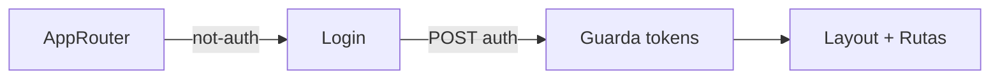

**Datos en localStorage:**
- token: Access token JWT
- refresh: Refresh token JWT
- user: Objeto con id, username, first_name, last_name

**Verificacion de token:** Cada 30 segundos decodifica JWT. Si expira en < 30seg intenta refrescar.

### 7.2 Rutas del Frontend

| Ruta | Componente | Descripcion |
|------|------------|-------------|
| /dashboardView | DashboardView | Dashboard principal |
| /rentalCalendarView | RentalCalendarView | Calendario de arriendos |
| /rentalView | RentalView | Lista de arriendos |
| /propertiesView | PropertiesView | Gestion de inmuebles |
| /productsView | ProductsView | Gestion de productos |
| /ratesView | RatesView | Gestion de tarifas |
| /hourRangesView | HourRangeView | Gestion de rangos de horas |
| /requirementsView | RequirementsView | Gestion de requisitos |
| /customersView | CustomersView | Gestion de clientes |
| /typeCustomersView | TypesCustomersView | Gestion de tipos de cliente |
| /usersView | UsersView | Gestion de usuarios |
| /reports | ReportView | Reportes |

### 7.3 Calendario de Arriendos

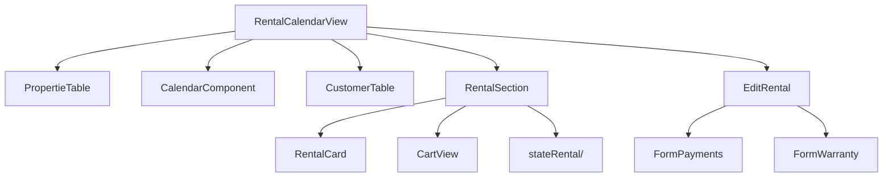

**Flujo de creacion:**
1. Selecciona salon en PropertieTable
2. Calendario muestra fechas disponibles
3. Clic en fecha -> abre RentalSection
4. Selecciona cliente en CustomerTable
5. Agrega productos al carrito
6. Clic en "Pre-reservar" -> POST /api/leases/

**Colores del calendario:**

| Color | Estado |
|-------|--------|
| #FFDD33 | Pre-reserva |
| #F79009 | Reserva |
| #1976D2 | Alquilado |
| #134E48 | Concluido |

### 7.4 Redux Store

```javascript
{
    auth:           // { status, user }
    rentals:        // { rentals, groupRentals, shoppingCart, ... }
    customers:      // { customers, flag }
    properties:     // { properties }
    products:       // { products, leakedProducts, flag }
    payments:       // { payments, amountTotal }
    warrantys:      // { warrantys, totalWarranty }
    users:          // { users }
    typesCustomers: // { typesCustomers }
    rates:          // { rates }
    requirements:   // { requirements }
    hourRanges:     // { hourRanges }
    events:         // { events }
    plans:          // { plans }
}
```

### 7.5 Comunicacion Frontend-Backend

```javascript
// coffeApi.ts
const coffeApi = axios.create({
    baseURL: VITE_HOST_BACKEND + '/api'
})
coffeApi.interceptors.request.use(config => {
    const token = localStorage.getItem('token')
    if (token) config.headers.Authorization = `Bearer ${token}`
    return config
})
```

### 7.6 Hooks Personalizados

| Hook | Proposito |
|------|-----------|
| useAuthStore | Login, logout, verificar token |
| useRentalStore | CRUD arriendos, calendario |
| useCustomerStore | CRUD clientes |
| useProductStore | CRUD productos |
| usePaymentsStore | CRUD pagos |
| useWarrantyStore | CRUD garantias |
| usePropertieStore | CRUD inmuebles |
| useUserStore | CRUD usuarios |

---

## 8. FORMULARIOS PDF Y REPORTES

### 8.1 Formularios PDF

| Formulario | Endpoint | Descripcion |
|------------|----------|-------------|
| Entrega y Recepcion | POST /api/leases/deliveryform/ | Formulario de entrega |
| Horas Extra | POST /api/leases/register_additional_hour_applied/ | Registro horas extra |
| Solicitud Devolucion | GET /api/financials/return_warranty_form/ | Solicitud devolucion |
| Devolucion Garantia | GET /api/financials/warranty_returned/ | Comprobante devolucion |
| Ejecucion Garantia | GET /api/financials/discount_warranty/ | Descuento por danos |
| Pagos | GET /api/financials/print_payments/{id}/ | Comprobante de pagos |
| Contrato | POST /api/requirements/register_delivered_requirements | Formulario contrato |

### 8.2 Reportes Excel

**Endpoint:** POST /api/leases/report

```json
{
    "start_date": "2026-01-01T00:00:00.000Z",
    "end_date": "2026-12-31T23:59:59.000Z",
    "state": 3
}
```

**Columnas por estado:**

| Estado | Columnas adicionales |
|--------|---------------------|
| Pre-reserva (1) | Edificio, Salon, Evento, Fecha, Contacto, NIT/CI, Telefono, Institucion, Plan |
| Reserva (2) | + Contrato |
| Alquilado (3) | + Pago, Fecha Pago, Garantia, Fecha Garantia, Horas Extra |
| Concluido (4) | + Solicitud Devolucion, Fecha Devolucion, Monto Retornado |
| Anulado (5) | Igual que Concluido |

---

## 9. GUIA DE MODIFICACIONES

### 9.1 Agregar campo a un modelo

1. Editar `app/models.py` -> agregar campo
2. `python manage.py makemigrations app`
3. `python manage.py migrate`
4. Actualizar serializer en `app/serializers.py`
5. Actualizar frontend (modelo TypeScript + formularios + tablas)

### 9.2 Agregar nuevo endpoint

1. Crear vista en `app/views.py`
2. Agregar URL en `app/urls.py`
3. Crear/actualizar serializer
4. Agregar en `Arriendos_Backend/urls.py` si es nuevo modulo
5. Frontend: hook + slice + componente

### 9.3 Agregar nuevo estado al arriendo

1. INSERT en BD: `INSERT INTO leases_state (name, next_state) VALUES ('Nuevo', '{4,5}')`
2. Actualizar next_state de estados existentes
3. Actualizar switcher en `leases/views.py`
4. Agregar logica de validacion
5. Frontend: color calendario + acciones en stateRental/

### 9.4 Agregar formulario PDF

1. Crear template HTML en `app/templates/`
2. Crear funcion generadora en `app/function.py` con WeasyPrint
3. Crear endpoint en `app/views.py`
4. Agregar URL en `app/urls.py`

### 9.5 Modificar logica de precios

**Ubicaciones clave:**
- Modelo: `products/models.py` -> Price
- Calculo total: `leases/views.py` -> Pre_Reserve_Api.post()
- Precio horas extra: `products/models.py` -> Price_Additional_Hour

**Flujo:** Product tiene Price activo -> Selected_Product guarda product_price -> Total = suma product_price - descuento plan.

### 9.6 Signals (Auditoria)

```python
# app/signals.py
@receiver(post_save, sender=MiModelo)
def mi_modelo_post_save(sender, instance, created, **kwargs):
    user = get_thread_variable('thread_user')
    Record.objects.create(
        user=user,
        action='create' if created else 'update',
        model='MiModelo',
        detail=str(instance),
        instance_id=instance.id
    )
```

---

## APENDICE A: SCRIPTS DE CARGA DE DATOS

**Ubicacion:** `Arriendos-Backend/initial_data/`

| Script | Descripcion |
|--------|-------------|
| load_data.py | Script maestro |
| requirements_data.py | Requisitos iniciales |
| customer_type.py | Tipos de cliente |
| rates_data.py | Tarifas |
| properties_data.py | Inmuebles |
| rooms_data.py | Salones |
| sub_rooms_data.py | Sub-ambientes |
| hour_range_data.py | Rangos de horas |
| products_data.py | Productos |
| state_data.py | Estados |
| plans_data.py | Planes de descuento |

**Uso:** `python load_data.py 127.0.0.1 9005`

---

## APENDICE B: VARIABLES DE ENTORNO

**Frontend (.env):**
```
VITE_HOST_BACKEND=http://localhost:9005
```

**Backend (settings.py):**
```python
DATABASES = {
    'default': {
        'ENGINE': 'django.db.backends.postgresql',
        'NAME': os.environ.get('DB_NAME', 'bd_arriendos'),
        'USER': os.environ.get('DB_USER', 'postgres'),
        'PASSWORD': os.environ.get('DB_PASSWORD', '123456'),
        'HOST': os.environ.get('DB_HOST', '127.0.0.1'),
        'PORT': os.environ.get('DB_PORT', '5432'),
    }
}
SIMPLE_JWT = {
    'ACCESS_TOKEN_LIFETIME': timedelta(hours=12),
    'REFRESH_TOKEN_LIFETIME': timedelta(days=1),
}
LDAP_STATUS = False
```

---

## APENDICE C: COMANDOS UTILES

```bash
# Desarrollo
python manage.py runserver 0.0.0.0:9005

# Migraciones
python manage.py makemigrations
python manage.py migrate

# Superusuario
python manage.py createsuperuser

# Shell
python manage.py shell

# Docker
docker build -t arriendos:latest .
docker run -d --name arriendos-app \
  --add-host=host.docker.internal:host-gateway \
  -e DB_HOST=host.docker.internal \
  -p 9005:9005 arriendos:latest
docker logs -f arriendos-app
```

---

## NOTA: FUNCIONALIDADES OCULTAS Y PROTECCION DE DOCUMENTOS PDF

> **Para:** Equipo de Desarrollo, Unidad de Sistemas y Soporte Tecnico
> **Fecha:** 29 de Julio de 2026
> **Motivo:** Funciones deshabilitadas intencionalmente en el Frontend

### Contexto

Durante las pruebas del sistema se identifico que **no existe un mecanismo de historial o snapshot** de los datos de un arriendo. Esto significa que si se modifican los subambientes o el campo de garantia de una habitacion, los documentos PDF generados previamente (formularios de entrega, horas extra, devolucion de garantia) perderian coherencia con los datos actuales.

### Que se oculto y por que

| Funcion | Archivo | Razon |
|---------|---------|-------|
| Crear subambientes | `SubEnviromentTable.tsx` | Los PDFs renderizan los subambientes tal como estan al momento de generar. Sin historial, una edicion posterior corromperia los documentos existentes. |
| Editar subambientes | `SubEnviromentTable.tsx` | Mismo motivo. El boton de edicion fue removido de la tabla. |
| Activar/desactivar subambientes | `SubEnviromentTable.tsx` | Sin snapshot, un cambio de estado afectaria el contenido de los PDFs ya emitidos. |
| Editar garantia de habitacion | `CreateRoom.tsx` | El campo `warranty` alimenta los templates `room_data.html`, `devolucion_de_garantia.html` y `reserva.html`. Solo editable al crear la habitacion, no al editar. |

### Cadenas de dependencia de datos (PDFs)

Los siguientes templates dependen de subambientes y garantia:

```
Sub_Room (modelo)
  └─ RoomsSerializer
      └─ ProductSerializer
          └─ Selected_ProductSerializer
              └─ RentalsSerializer
                  ├─ entrega_y_recepcion_de_ambientes.html
                  ├─ horas_extra.html
                  └─ devolucion_de_garantia.html
```

**Si se edita un subambiente o la garantia, el proximo PDF generado mostrara los datos nuevos, pero los PDFs anteriores quedarian con datos desactualizados.**

### Solucion pendiente: RentalSnapshot

Se diseño pero no se implemento un modelo `RentalSnapshot` que:

1. Se crea automaticamente al pasar el arriendo a estado **Reserva (2)**
2. Guarda una copia de los datos de ambientes, subambientes, precios y garantia
3. Los templates PDF leen desde el snapshot en lugar del modelo actual
4. Los datos actuales se usan solo para el proximo PDF, no para los existentes

**Mientras no se implemente este mecanismo, las funciones permanecen ocultas.**

### Que SI puede hacer el usuario

| Operacion | Estado |
|-----------|--------|
| Ver subambientes (solo lectura) | Habilitado |
| Agregar habitaciones nuevas | Habilitado (con warranty obligatorio) |
| Editar nombre/capacidad de habitacion | Habilitado |
| Editar precio/tarifa de habitacion | Habilitado (afecta solo nuevos arriendos) |
| Ver historial de subambientes | No disponible |

### Accion requerida para reactivar

Cuando se decida implementar el snapshot:

1. Crear modelo `RentalSnapshot` en `leases/models.py`
2. Migracion: `python manage.py makemigrations leases && python manage.py migrate`
3. Modificar templates para leer desde snapshot
4. Reactivar controles en `SubEnviromentTable.tsx` y `CreateRoom.tsx`

---

> **Fin del Manual Tecnico v2.1**
